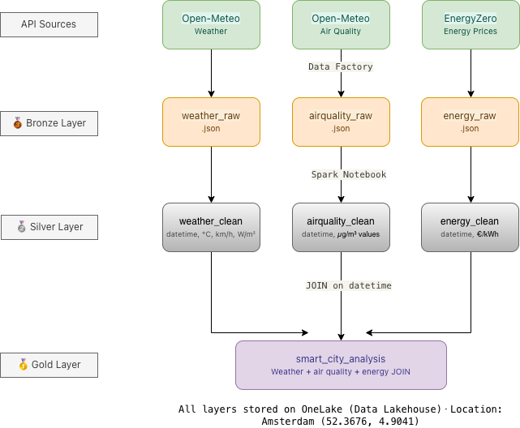
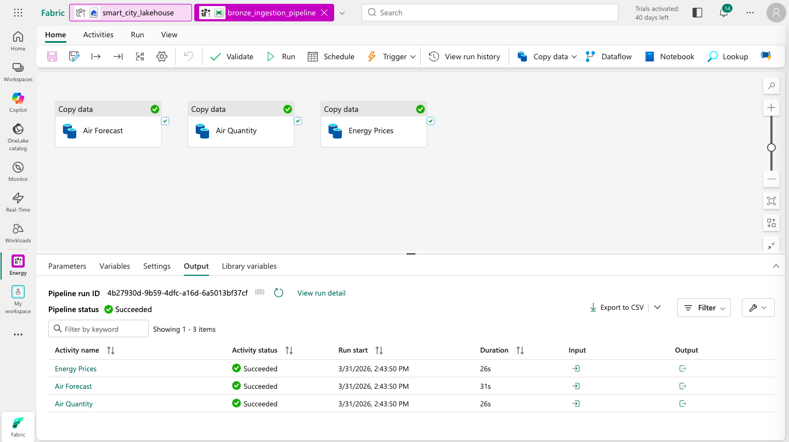
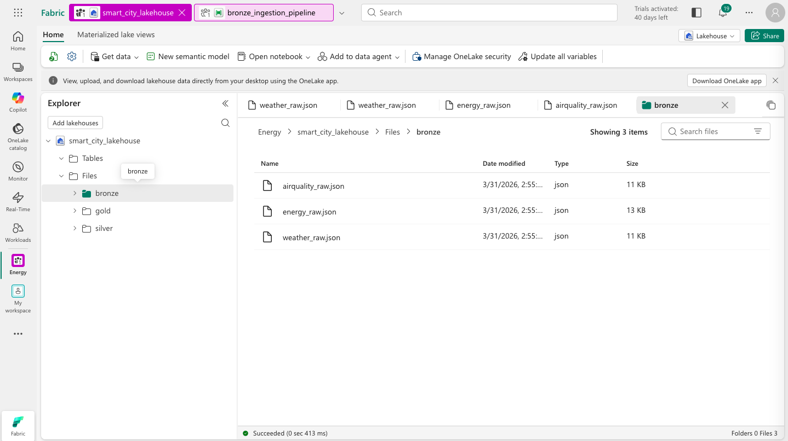
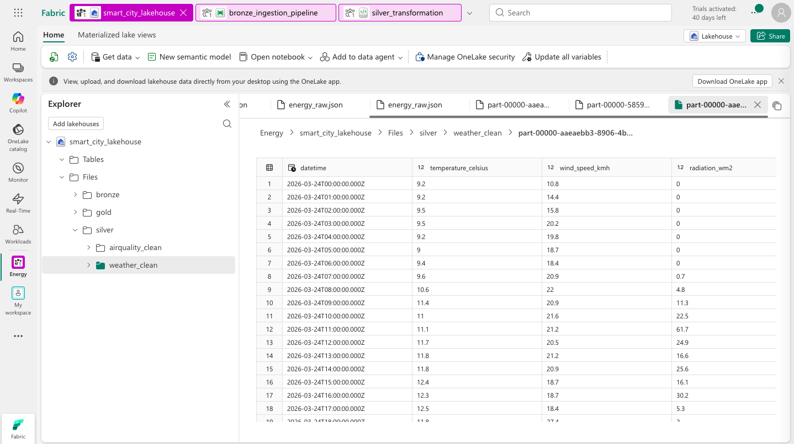
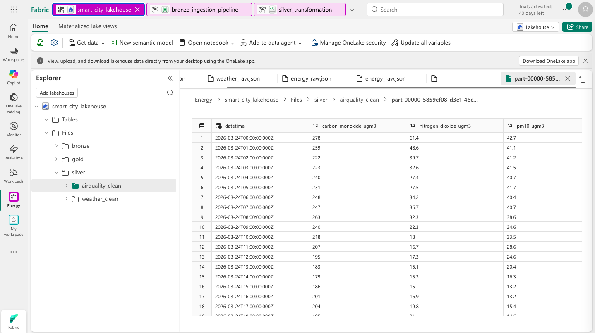
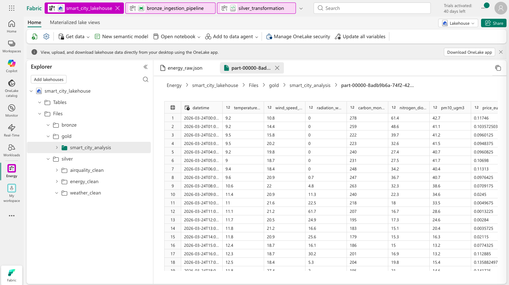
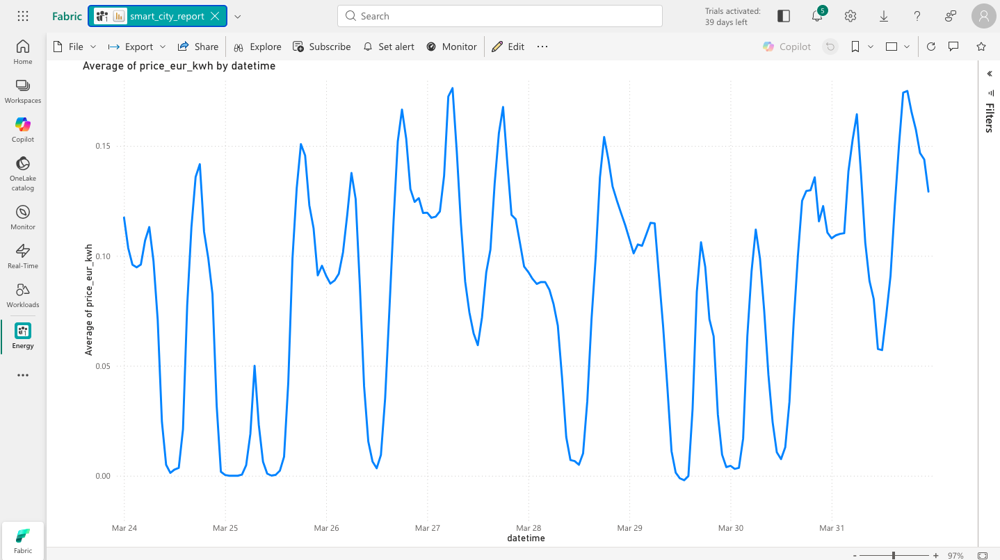

# Smart City Monitoring System
### A Data Engineering Project | Medallion Architecture on Microsoft Fabric

This project builds an end-to-end data pipeline that collects weather, air quality, and energy price data for Amsterdam, transforms it through a Medallion Architecture, and visualizes insights to answer one key question:

> **When is energy cheapest AND cleanest to use?**

---

## Architecture



---

## Pipeline Overview



All 3 API sources collected successfully via Data Factory.

---

## Tech Stack

| Tool | Purpose |
|------|---------|
| Microsoft Fabric | Cloud platform |
| Data Factory | API ingestion (Bronze layer) |
| Apache Spark (PySpark) | Data transformation (Silver & Gold) |
| OneLake | Data Lakehouse storage |
| Power BI | Visualization |
| Draw.io | Architecture diagram |

---

## Data Sources

| API | Data | Endpoint |
|-----|------|----------|
| Open-Meteo Weather | Temperature, wind speed, solar radiation | `api.open-meteo.com/v1/forecast` |
| Open-Meteo Air Quality | Carbon monoxide, nitrogen dioxide, PM10 | `air-quality-api.open-meteo.com/v1/air-quality` |
| EnergyZero | Hourly energy prices (€/kWh) | `api.energyzero.nl/v1/energyprices` |

**Location:** Amsterdam, Netherlands (52.3676, 4.9041)

---

## Project Structure

```
smart-city-monitoring/
│
├── diagrams/
│   └── medallion_architecture.png
│
├── screenshots/
│   ├── 01_bronze_pipeline.png
│   ├── 02_bronze_files.png
│   ├── 03_silver_weather.png
│   ├── 04_silver_airquality.png
│   ├── 05_silver_energy.png
│   ├── 06_gold_table.png
│   └── 07_powerbi_report.png
│
├── notebooks/
│   └── silver_transformation.ipynb
│
└── README.md
```

---

## Bronze Layer — Raw Data



Raw JSON files collected from 3 APIs and stored in OneLake.

---

## Silver Layer — Cleaned Data



Raw JSON transformed into clean Parquet tables using PySpark.



---

## Gold Layer — Analytical Data



All 3 datasets joined on `datetime` into a single analytical table with 8 columns.

---

## Power BI Report



- Energy prices peak in the **morning (7–9AM)** and **evening (17–20PM)**
- Prices are lowest between **midnight and 5AM**
- Higher wind speeds correlate with **lower energy prices**

---

## How to Run

1. Create a Microsoft Fabric workspace
2. Create a Lakehouse named `smart_city_lakehouse`
3. Create folders: `Files/bronze`, `Files/silver`, `Files/gold`
4. Import and run `bronze_ingestion_pipeline` to collect raw data
5. Open `silver_transformation` notebook and run all cells
6. Connect Power BI to `smart_city_analysis` table for visualization

---

## Author

**Esra Demirturk Duman**
[LinkedIn](https://www.linkedin.com/in/esrademirturkduman)

---

*Built as part of Werhere Academy Data Engineering Program*
